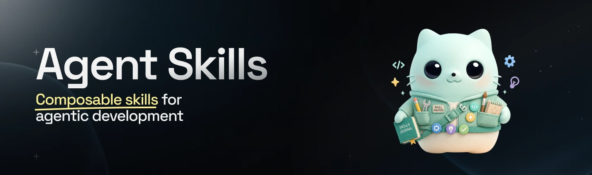

# Agent Skills

Independent, reusable skills for coding agents. Install them with the open
`skills` CLI—no custom installer required.

Read [Avoiding agentic drift in large codebases](https://kevinkern.dev/posts/agentic-drift-in-large-codebase/)
for why these skills exist and how I use them in practice.

## Install

List all skills:

```bash
npx skills add instructa/agent-skills --list
```

Install one skill (or copy a command from the table below):

```bash
npx skills add instructa/agent-skills --skill architecture-ownership
```

Use `-g` for a global installation. Supported agents include Codex, Claude Code,
Cursor, and other Agent Skills clients.

## Available Skills

Stars show how often I have actually used a skill in distinct local Codex sessions:
`★★★★★` 100+, `★★★★☆` 25–99, `★★★☆☆` 10–24, `★★☆☆☆` 2–9, and
`★☆☆☆☆` 0–1. The scan includes my main, Kevin, and benchmark profiles through
August 13, 2026, and groups direct predecessors that were renamed. This is maintainer
usage, not a quality score—specialized skills naturally appear less often.

### Engineering

| Skill | Purpose | Usage | Install |
|---|---|---|---|
| [hard-cut](skills/engineering/hard-cut/README.md) | Replace legacy paths with one canonical implementation. | `★★★★★` · 408 sessions | `npx skills add instructa/agent-skills --skill hard-cut` |
| [consolidate-test-suites](skills/engineering/consolidate-test-suites/README.md) | Put regression coverage in the owning test layer. | `★★★★★` · 331 sessions | `npx skills add instructa/agent-skills --skill consolidate-test-suites` |
| [root-cause-finder](skills/engineering/root-cause-finder/README.md) | Trace failures to their first unintended cause. | `★★★★★` · 159 sessions | `npx skills add instructa/agent-skills --skill root-cause-finder` |
| [architecture-ownership](skills/engineering/architecture-ownership/README.md) | Find the right owner for code and behavior. | `★★★★★` · 142 sessions | `npx skills add instructa/agent-skills --skill architecture-ownership` |
| [find-duplicate-ownership](skills/engineering/find-duplicate-ownership/README.md) | Find competing sources of truth. | `★★★★☆` · 77 sessions | `npx skills add instructa/agent-skills --skill find-duplicate-ownership` |
| [search-context](skills/engineering/search-context/README.md) | Find useful reference repositories before implementing. | `★★☆☆☆` · 6 sessions | `npx skills add instructa/agent-skills --skill search-context` |
| [clarify](skills/engineering/clarify/README.md) | Make complex technical material clear and actionable. | `★★☆☆☆` · 2 sessions | `npx skills add instructa/agent-skills --skill clarify` |

### Security

| Skill | Purpose | Usage | Install |
|---|---|---|---|
| [secleak-check](skills/security/secleak-check/README.md) | Scan for secrets and repository risks. | `★★★☆☆` · 24 sessions | `npx skills add instructa/agent-skills --skill secleak-check` |
| [package-security-check](skills/security/package-security-check/README.md) | Audit JavaScript supply-chain risks. | `★★★☆☆` · 20 sessions | `npx skills add instructa/agent-skills --skill package-security-check` |

### Git

| Skill | Purpose | Usage | Install |
|---|---|---|---|
| [gitwhat](skills/git/gitwhat/README.md) | Show a concise repository and worktree status. | `★★★★☆` · 34 sessions | `npx skills add instructa/agent-skills --skill gitwhat` |

### Go

| Skill | Purpose | Usage | Install |
|---|---|---|---|
| [go-local-health](skills/go/go-local-health/README.md) | Run Go tests, coverage, and lint checks. | `★☆☆☆☆` · 1 session | `npx skills add instructa/agent-skills --skill go-local-health` |

### Electron

| Skill | Purpose | Usage | Install |
|---|---|---|---|
| [electron-live-test](skills/electron/electron-live-test/README.md) | Test Electron apps with native-devtools-mcp and CDP. | `★☆☆☆☆` · 1 session | `npx skills add instructa/agent-skills --skill electron-live-test` |

### Shell

| Skill | Purpose | Usage | Install |
|---|---|---|---|
| [shellck](skills/shell/shellck/README.md) | Run ShellCheck on repository scripts. | `★☆☆☆☆` · 1 session | `npx skills add instructa/agent-skills --skill shellck` |

### Release

| Skill | Purpose | Usage | Install |
|---|---|---|---|
| [homebrew-publish](skills/release/homebrew-publish/README.md) | Prepare and validate Homebrew releases. | `★☆☆☆☆` · 1 session | `npx skills add instructa/agent-skills --skill homebrew-publish` |

### Specs

| Skill | Purpose | Usage | Install |
|---|---|---|---|
| [app-spec-packager](skills/specs/app-spec-packager/README.md) | Create implementation-ready application specifications. | `★★☆☆☆` · 2 sessions | `npx skills add instructa/agent-skills --skill app-spec-packager` |

### Design

| Skill | Purpose | Usage | Install |
|---|---|---|---|
| [redesign-my-landingpage](skills/design/redesign-my-landingpage/README.md) | Build and improve React landing pages. | `★☆☆☆☆` · 1 session | `npx skills add instructa/agent-skills --skill redesign-my-landingpage` |

## Principles

- Public skills are installed with `npx skills`.
- Core engineering skills do not depend on PlanDB, Planr, Instructa, or AgentRig.
- Tool-specific skills only require tools needed for their stated purpose.
- Category folders do not change public skill names.

## Links

- X/Twitter: [@kregenrek](https://x.com/kregenrek)
- Bluesky: [@kevinkern.dev](https://bsky.app/profile/kevinkern.dev)
- [Instructa](https://www.instructa.ai)
